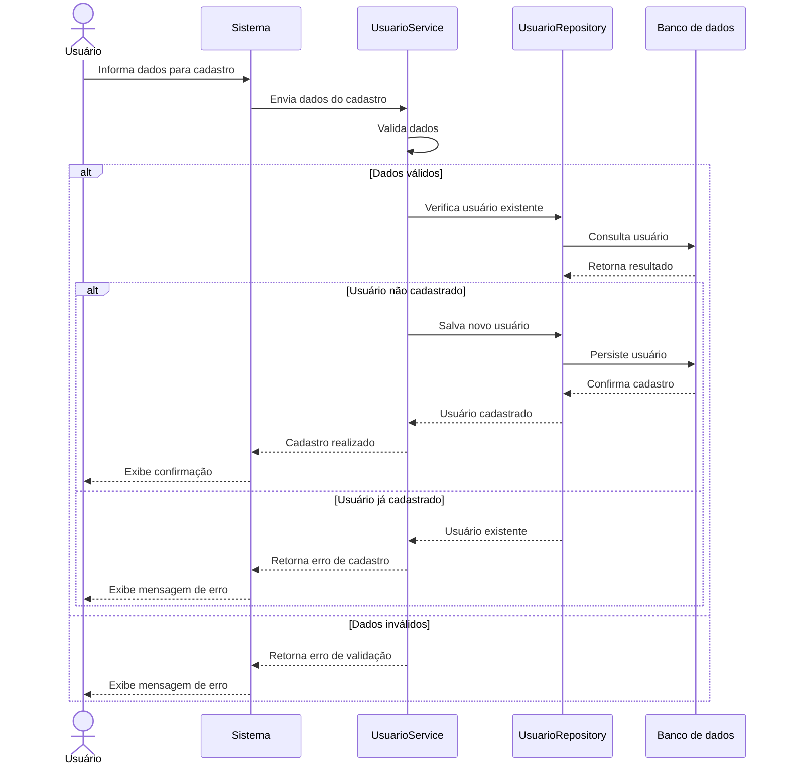
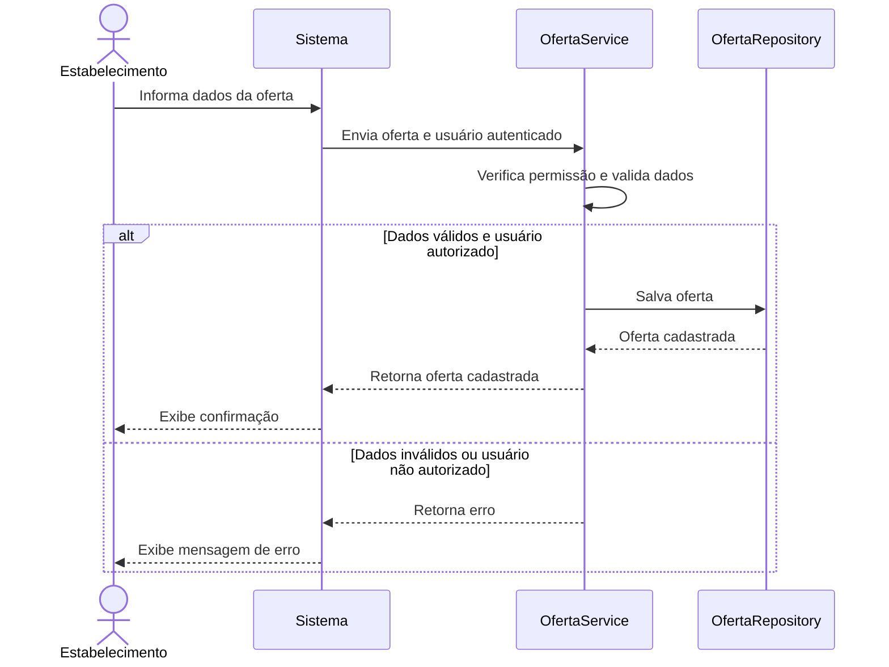
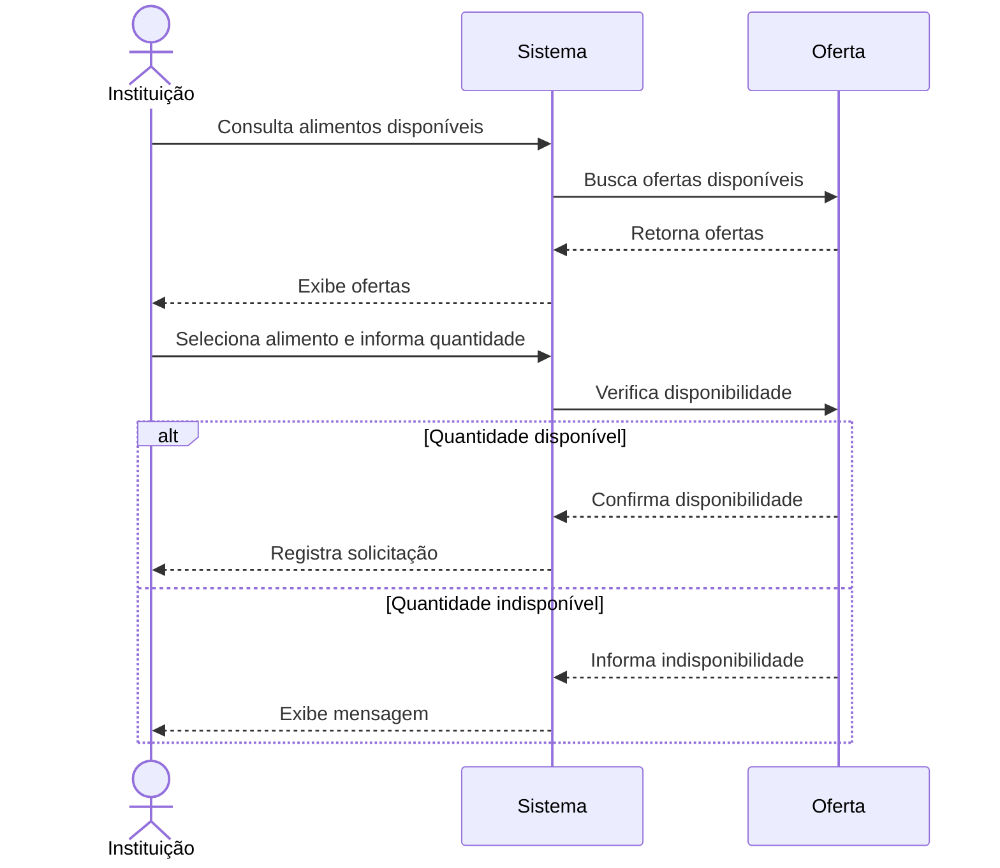
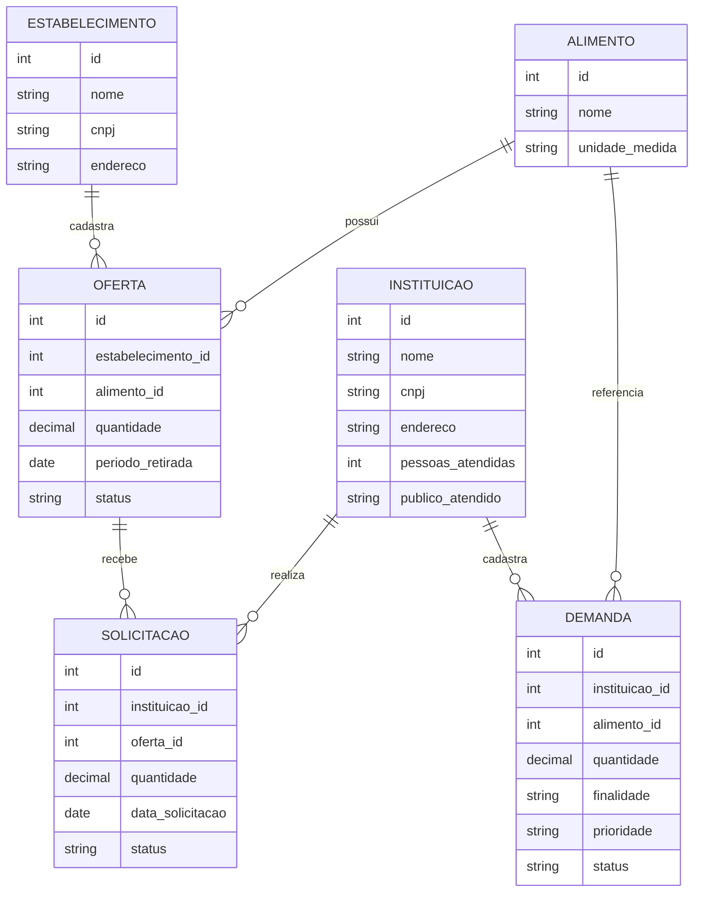

# Modelagem do sistema

> **Artefato central da Sprint 3.** Os modelos apresentados representam aspectos estruturais e comportamentais do sistema Conexão Solidária e estão relacionados aos requisitos definidos nas etapas anteriores do projeto.

## 1. Modelos selecionados

| Modelo | Tipo | Pergunta que ele ajuda a responder | Requisitos relacionados |
|---|---|---|---|
| Diagrama de sequência — Cadastro de usuário | Comportamental | Como um usuário é validado e cadastrado no sistema? | RF-01, RF-02, RF-03, RF-04 e RF-05 |
| Diagrama de sequência — Cadastro de oferta | Comportamental | Como um estabelecimento cadastra uma oferta de alimento? | RF-07 e RF-09 |
| Diagrama de sequência — Solicitação de alimento | Comportamental | Como ocorre o processo de solicitação de um alimento por uma instituição? | RF-08, RF-10, RF-11, RF-12 e RF-13 |
| Diagrama estrutural — Conexão Solidária | Estrutural | Quais são os principais elementos do sistema e como eles se relacionam? | RF-01 a RF-23 |

## 2. Modelo comportamental em Mermaid

### 2.1 Diagrama de sequência — Cadastro de usuário

O fluxo de cadastro de usuário está implementado por `UsuarioController`, `UsuarioService` e `UsuarioRepository`. A validação de nome, e-mail e duplicidade é realizada pelo serviço. O participante `Banco de dados` representa a persistência prevista no modelo; na implementação atual, o repositório mantém os dados em memória e a persistência em banco ainda não está implementada.

### 2.2 Diagrama de sequência — Cadastro de oferta

O cadastro de oferta está implementado por `OfertaController`, `OfertaService` e `OfertaRepository`, com autenticação e controle da permissão `CADASTRAR_OFERTA`. O serviço valida alimento, quantidade, unidade de medida e data limite para retirada antes de salvar a oferta.

### 2.3 Diagrama de sequência — Solicitação de alimento

**Descrição e decisões representadas:** O modelo representa o fluxo de solicitação de alimentos realizado por uma instituição beneficiária. Inicialmente, a instituição consulta os alimentos disponíveis no sistema. Após selecionar uma oferta, informa a quantidade desejada.

O sistema verifica se a quantidade solicitada está disponível. Caso esteja, a solicitação é registrada. Caso contrário, o sistema informa que a quantidade não está disponível.

O fluxo foi escolhido por representar uma das principais funcionalidades do Conexão Solidária e por envolver diretamente o relacionamento entre instituições, ofertas e solicitações.

O fluxo de solicitação permanece como modelo comportamental do requisito, mas seus elementos de solicitação ainda não possuem implementação correspondente no código atual. Portanto, `Solicitação`, seu cadastro, seu acompanhamento e seu relacionamento operacional com `Oferta` estão **Ainda não implementado**.

## 3. Modelo estrutural em Mermaid

**Descrição e decisões representadas:** O modelo estrutural apresenta os principais elementos envolvidos no funcionamento do Conexão Solidária.

A entidade `ESTABELECIMENTO` representa os estabelecimentos responsáveis por disponibilizar alimentos excedentes. Um estabelecimento pode cadastrar diferentes ofertas.

A entidade `INSTITUICAO` representa as instituições beneficiárias que utilizam a plataforma para consultar alimentos e realizar solicitações. A instituição também pode cadastrar demandas relacionadas às suas necessidades.

A entidade `ALIMENTO` representa os alimentos utilizados tanto nas ofertas quanto nas demandas.

A entidade `OFERTA` registra os alimentos disponibilizados pelos estabelecimentos, enquanto `SOLICITACAO` registra o interesse de uma instituição em receber determinada quantidade de uma oferta.

A entidade `DEMANDA` representa as necessidades cadastradas pelas instituições, contendo informações como quantidade, finalidade e prioridade.

A separação dessas entidades permite representar de forma mais clara os diferentes papéis e operações existentes no sistema.

## 4. Relação entre requisitos e modelos

| Requisito | Elemento do modelo             | Como está representado              | Alteração provocada no backlog/código             |
| --------- | ------------------------------ | ----------------------------------- | ------------------------------------------------- |
| RF-01     | Estabelecimento                | Entidade `ESTABELECIMENTO`          | Cadastro de estabelecimento.                      |
| RF-02     | Instituição                    | Entidade `INSTITUICAO`              | Cadastro de instituição.                          |
| RF-03     | Instituição                    | Dados da instituição                | Informações necessárias para o cadastro.          |
| RF-04     | Instituição                    | Dados relacionados à instituição    | Controle das informações cadastradas.             |
| RF-05     | Instituição / Estabelecimento  | Participantes do sistema            | Identificação dos usuários dos diferentes perfis. |
| RF-06     | Instituição / Estabelecimento  | Acesso às funcionalidades           | Diferenciação dos perfis.                         |
| RF-07     | Oferta                         | Entidade `OFERTA`                   | Cadastro de alimentos disponíveis para doação.    |
| RF-08     | Oferta / Alimento              | Relação entre `OFERTA` e `ALIMENTO` | Consulta dos alimentos disponíveis.               |
| RF-09     | Oferta                         | Atributos de quantidade e período   | Informações utilizadas na consulta das ofertas.   |
| RF-10     | Solicitação                    | Entidade `SOLICITACAO`              | Registro das solicitações.                        |
| RF-11     | Oferta / Solicitação           | Relacionamento entre as entidades   | Controle das solicitações realizadas.             |
| RF-12     | Solicitação                    | Atributo `status`                   | Acompanhamento da solicitação.                    |
| RF-13     | Solicitação                    | Atributo `data_solicitacao`         | Registro da solicitação.                          |
| RF-14     | Oferta / Solicitação           | Relação entre oferta e solicitação  | Controle das operações realizadas.                |
| RF-15     | Instituição                    | Entidade `INSTITUICAO`              | Informações sobre a instituição beneficiária.     |
| RF-16     | Demanda                        | Entidade `DEMANDA`                  | Cadastro das necessidades.                        |
| RF-17     | Demanda                        | Atributo `prioridade`               | Classificação das demandas.                       |
| RF-18     | Demanda                        | Atributo `quantidade`               | Registro da quantidade necessária.                |
| RF-19     | Demanda                        | Atributo `finalidade`               | Registro da finalidade da demanda.                |
| RF-20     | Demanda                        | Consulta da entidade `DEMANDA`      | Visualização das necessidades cadastradas.        |
| RF-21     | Oferta / Demanda               | Relação por meio de `ALIMENTO`      | Identificação de possíveis correspondências.      |
| RF-22     | Alimento                       | Entidade `ALIMENTO`                 | Organização dos alimentos utilizados no sistema.  |
| RF-23     | Oferta / Solicitação / Demanda | Operações do sistema                | Comunicação e acompanhamento das operações.       |

## 5. Correspondência entre modelo e código

| Elemento modelado | Arquivo/diretório correspondente | Observação |
|---|---|---|
| Interface do sistema | [`front-end/`](../front-end/) | Contém a interface utilizada pelos usuários. |
| Estrutura visual | [`front-end/style.css`](../front-end/style.css) e [`front-end/index.html`](../front-end/index.html) | Contém os arquivos responsáveis pela apresentação das páginas. |
| Interações da interface | [`front-end/script.js`](../front-end/script.js) | Contém os comportamentos implementados no lado do cliente. |
| Cadastro de usuário | [`UsuarioController.java`](../BackEnd/src/main/java/conexaosolidaria/controller/UsuarioController.java) | Implementado em conjunto com [`UsuarioService.java`](../BackEnd/src/main/java/conexaosolidaria/service/UsuarioService.java) e [`UsuarioRepository.java`](../BackEnd/src/main/java/conexaosolidaria/repository/UsuarioRepository.java). |
| Estabelecimento | [`front-end/`](../front-end/) | Entidade específica ainda não possui classe, controller, service ou repository correspondente no backend. **Ainda não implementado**. |
| Instituição | [`Usuario.java`](../BackEnd/src/main/java/conexaosolidaria/model/Usuario.java) e [`PerfilUsuario.java`](../BackEnd/src/main/java/conexaosolidaria/model/PerfilUsuario.java) | Representada pelo cadastro de usuário e pelo perfil; entidade `INSTITUICAO` separada ainda não existe. |
| Alimento | [`Oferta.java`](../BackEnd/src/main/java/conexaosolidaria/model/Oferta.java) e [`Demanda.java`](../BackEnd/src/main/java/conexaosolidaria/model/Demanda.java) | Representado pelo atributo textual `alimento`; classe `Alimento` específica ainda não existe. **Ainda não implementado**. |
| Oferta | [`OfertaController.java`](../BackEnd/src/main/java/conexaosolidaria/controller/OfertaController.java), [`OfertaService.java`](../BackEnd/src/main/java/conexaosolidaria/service/OfertaService.java) e [`OfertaRepository.java`](../BackEnd/src/main/java/conexaosolidaria/repository/OfertaRepository.java) | Cadastro e consulta de ofertas implementados. |
| Solicitação | Não há arquivo correspondente no backend | Cadastro, consulta e acompanhamento de solicitações. **Ainda não implementado**. |
| Demanda | [`DemandaController.java`](../BackEnd/src/main/java/conexaosolidaria/controller/DemandaController.java), [`DemandaService.java`](../BackEnd/src/main/java/conexaosolidaria/service/DemandaService.java) e [`DemandaRepository.java`](../BackEnd/src/main/java/conexaosolidaria/repository/DemandaRepository.java) | Cadastro e consulta de demandas implementados. |
| Banco de dados | [`repository/`](../BackEnd/src/main/java/conexaosolidaria/repository/) | Os repositórios atuais mantêm os dados em memória; persistência em banco ainda não está implementada. |

Os diagramas de cadastro de usuário e cadastro de oferta possuem correspondência com os componentes listados acima. O diagrama de solicitação representa o comportamento desejado pelos requisitos, mas permanece sem implementação correspondente.

## 6. Revisão dos requisitos e do backlog

A revisão da Sprint 3 verificou a correspondência entre os requisitos funcionais RF-01 a RF-23, os modelos elaborados e o código disponível. O escopo e a identificação dos requisitos foram mantidos sem alterações.

| Grupo de requisitos | Resultado da revisão | Situação no código |
|---|---|---|
| RF-01 a RF-06 | Relacionados ao cadastro, identificação e acesso dos usuários e perfis. | Parcialmente implementado por `UsuarioController`, `UsuarioService`, `AuthService`, `AccessControl` e `PerfilUsuario`. |
| RF-07 a RF-09 | Relacionados ao cadastro e consulta de ofertas. | Implementado por `OfertaController`, `OfertaService` e `OfertaRepository`. |
| RF-10 a RF-14 | Relacionados ao registro e acompanhamento de solicitações. | **Ainda não implementado**. Não há classe, controller, service ou repository de solicitação. |
| RF-15 | Relacionado às informações da instituição beneficiária. | **Ainda não implementado** como entidade `INSTITUICAO` separada; há cadastro de usuário com perfil. |
| RF-16 a RF-20 | Relacionados ao cadastro, classificação e consulta de demandas. | Implementado por `DemandaController`, `DemandaService` e `DemandaRepository`. |
| RF-21 | Relacionado à identificação de correspondências entre ofertas e demandas. | **Ainda não implementado**. |
| RF-22 | Relacionado à organização dos alimentos. | Representado por campos textuais em ofertas e demandas; classe `Alimento` específica **Ainda não implementado**. |
| RF-23 | Relacionado à comunicação e ao acompanhamento das operações. | Parcialmente implementado nos endpoints de usuários, ofertas e demandas; solicitação e correspondência **Ainda não implementado**. |

Como resultado da revisão, o backlog deve manter como pendências a implementação de solicitações, da correspondência entre ofertas e demandas, da entidade específica de alimento, da entidade específica de instituição e da persistência em banco de dados. Essas pendências não alteram o escopo dos requisitos funcionais.

## 7. Refinamentos identificados

Durante a elaboração da modelagem, foram identificados alguns pontos importantes para representar o funcionamento do sistema:

- A separação entre `ESTABELECIMENTO` e `INSTITUICAO` representa os dois principais papéis envolvidos na plataforma.
- A entidade `OFERTA` foi separada de `SOLICITACAO`, permitindo diferenciar o alimento disponibilizado da solicitação realizada por uma instituição.
- A entidade `DEMANDA` foi criada separadamente das ofertas para representar as necessidades informadas pelas instituições.
- A entidade `ALIMENTO` é utilizada tanto pelas ofertas quanto pelas demandas, permitindo relacionar os dois processos.
- Os atributos de quantidade permitem representar tanto os alimentos disponibilizados quanto as necessidades das instituições.
- O atributo `status` permite acompanhar o estado de ofertas, solicitações e demandas.
- Os modelos comportamentais passaram a representar os fluxos de cadastro de usuário, cadastro de oferta e solicitação de alimento.
- A modelagem foi mantida compatível com a divisão existente entre `front-end/` e `BackEnd/`.

## 8. Histórico de atualização

| Sprint | Modelo alterado | Motivo | Evidência |
|---|---|---|---|
| Sprint 3 | Modelo comportamental | Representar os fluxos de cadastro de usuário, cadastro de oferta e solicitação de alimentos. | [`modelagem.md`](modelagem.md) |
| Sprint 3 | Modelo estrutural | Representar as principais entidades e relacionamentos do sistema. | [`modelagem.md`](modelagem.md) |
| Sprint 3 | Relação entre requisitos e modelos | Relacionar os requisitos funcionais aos modelos desenvolvidos. | [`requisitos.md`](../docs/requisitos/requisitos.md) |
| Sprint 3 | Correspondência entre modelo e código | Relacionar os modelos às estruturas implementadas no projeto e registrar pendências. | [`front-end/`](../front-end/) e [`BackEnd/`](../BackEnd/) |
| Sprint 3 | Revisão dos requisitos e backlog | Conferir o escopo dos RF-01 a RF-23 e registrar itens implementados e pendentes. | [`modelagem.md`](modelagem.md) |
| Sprint 3 | Refinamentos | Registrar as decisões tomadas durante a elaboração da modelagem. | [`modelagem.md`](modelagem.md) |
