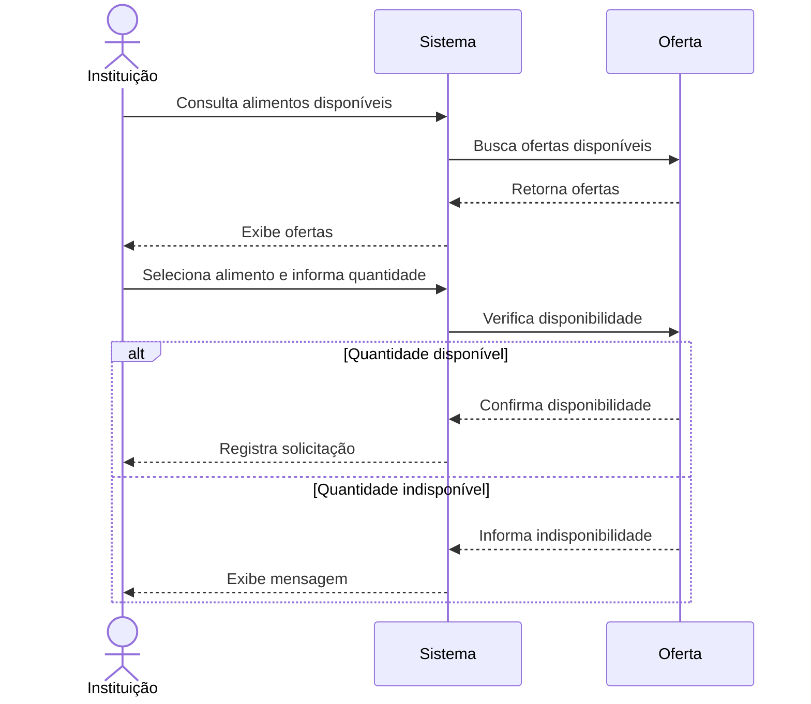
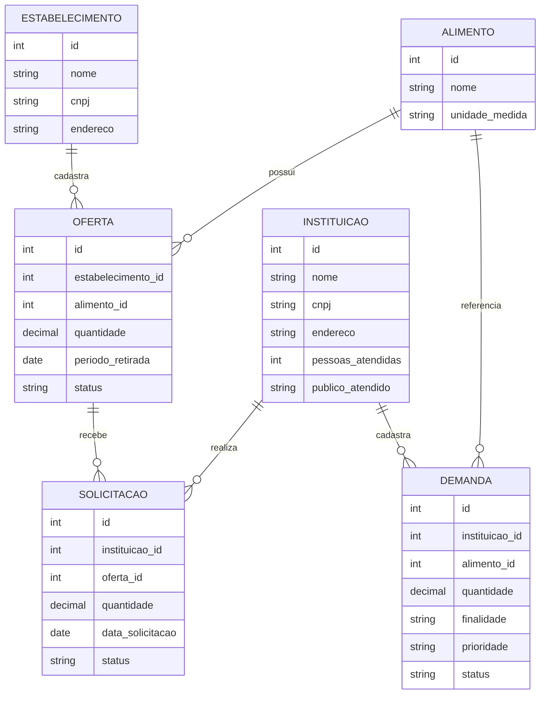

# Modelagem do sistema

> Artefato central da Sprint 3. Os modelos apresentados representam aspectos estruturais e comportamentais do sistema Conexão Solidária e estão relacionados aos requisitos definidos nas etapas anteriores do projeto.

## 1. Modelos selecionados

| Modelo                                          | Tipo           | Pergunta que ele ajuda a responder                                        | Requisitos relacionados            |
| ----------------------------------------------- | -------------- | ------------------------------------------------------------------------- | ---------------------------------- |
| Diagrama de sequência — Solicitação de alimento | Comportamental | Como ocorre o processo de solicitação de um alimento por uma instituição? | RF-08, RF-10, RF-11, RF-12 e RF-13 |
| Diagrama estrutural — Conexão Solidária         | Estrutural     | Quais são os principais elementos do sistema e como eles se relacionam?   | RF-01 a RF-23                      |

## 2. Modelo comportamental em Mermaid

**Descrição e decisões representadas:** O modelo representa o fluxo de solicitação de alimentos realizado por uma instituição beneficiária. Inicialmente, a instituição consulta os alimentos disponíveis no sistema. Após selecionar uma oferta, informa a quantidade desejada.

O sistema verifica se a quantidade solicitada está disponível. Caso esteja, a solicitação é registrada. Caso contrário, o sistema informa que a quantidade não está disponível.

O fluxo foi escolhido por representar uma das principais funcionalidades do Conexão Solidária e por envolver diretamente o relacionamento entre instituições, ofertas e solicitações.

## 3. Modelo estrutural em Mermaid

**Descrição e decisões representadas:** O modelo estrutural apresenta os principais elementos envolvidos no funcionamento do Conexão Solidária.

A entidade `ESTABELECIMENTO` representa os estabelecimentos responsáveis por disponibilizar alimentos excedentes. Um estabelecimento pode cadastrar diferentes ofertas.

A entidade `INSTITUICAO` representa as instituições beneficiárias que utilizam a plataforma para consultar alimentos e realizar solicitações. A instituição também pode cadastrar demandas relacionadas às suas necessidades.

A entidade `ALIMENTO` representa os alimentos utilizados tanto nas ofertas quanto nas demandas.

A entidade `OFERTA` registra os alimentos disponibilizados pelos estabelecimentos, enquanto `SOLICITACAO` registra o interesse de uma instituição em receber determinada quantidade de uma oferta.

A entidade `DEMANDA` representa as necessidades cadastradas pelas instituições, contendo informações como quantidade, finalidade e prioridade.

A separação dessas entidades permite representar de forma mais clara os diferentes papéis e operações existentes no sistema.

## 4. Relação entre requisitos e modelos

| Requisito | Elemento do modelo             | Como está representado              | Alteração provocada no backlog/código             |
| --------- | ------------------------------ | ----------------------------------- | ------------------------------------------------- |
| RF-01     | Estabelecimento                | Entidade `ESTABELECIMENTO`          | Cadastro de estabelecimento.                      |
| RF-02     | Instituição                    | Entidade `INSTITUICAO`              | Cadastro de instituição.                          |
| RF-03     | Instituição                    | Dados da instituição                | Informações necessárias para o cadastro.          |
| RF-04     | Instituição                    | Dados relacionados à instituição    | Controle das informações cadastradas.             |
| RF-05     | Instituição / Estabelecimento  | Participantes do sistema            | Identificação dos usuários dos diferentes perfis. |
| RF-06     | Instituição / Estabelecimento  | Acesso às funcionalidades           | Diferenciação dos perfis.                         |
| RF-07     | Oferta                         | Entidade `OFERTA`                   | Cadastro de alimentos disponíveis para doação.    |
| RF-08     | Oferta / Alimento              | Relação entre `OFERTA` e `ALIMENTO` | Consulta dos alimentos disponíveis.               |
| RF-09     | Oferta                         | Atributos de quantidade e período   | Informações utilizadas na consulta das ofertas.   |
| RF-10     | Solicitação                    | Entidade `SOLICITACAO`              | Registro das solicitações.                        |
| RF-11     | Oferta / Solicitação           | Relacionamento entre as entidades   | Controle das solicitações realizadas.             |
| RF-12     | Solicitação                    | Atributo `status`                   | Acompanhamento da solicitação.                    |
| RF-13     | Solicitação                    | Atributo `data_solicitacao`         | Registro da solicitação.                          |
| RF-14     | Oferta / Solicitação           | Relação entre oferta e solicitação  | Controle das operações realizadas.                |
| RF-15     | Instituição                    | Entidade `INSTITUICAO`              | Informações sobre a instituição beneficiária.     |
| RF-16     | Demanda                        | Entidade `DEMANDA`                  | Cadastro das necessidades.                        |
| RF-17     | Demanda                        | Atributo `prioridade`               | Classificação das demandas.                       |
| RF-18     | Demanda                        | Atributo `quantidade`               | Registro da quantidade necessária.                |
| RF-19     | Demanda                        | Atributo `finalidade`               | Registro da finalidade da demanda.                |
| RF-20     | Demanda                        | Consulta da entidade `DEMANDA`      | Visualização das necessidades cadastradas.        |
| RF-21     | Oferta / Demanda               | Relação por meio de `ALIMENTO`      | Identificação de possíveis correspondências.      |
| RF-22     | Alimento                       | Entidade `ALIMENTO`                 | Organização dos alimentos utilizados no sistema.  |
| RF-23     | Oferta / Solicitação / Demanda | Operações do sistema                | Comunicação e acompanhamento das operações.       |

## 5. Correspondência entre modelo e código

| Elemento modelado       | Arquivo/diretório correspondente | Observação                                                               |
| ----------------------- | -------------------------------- | ------------------------------------------------------------------------ |
| Interface do sistema    | `front-end/`                     | Contém a interface utilizada pelos usuários.                             |
| Estrutura visual        | `front-end/`                     | Contém os arquivos responsáveis pela apresentação das páginas.           |
| Interações da interface | `front-end/script.js`            | Contém os comportamentos implementados no lado do cliente.               |
| Estabelecimento         | `front-end/` e `BackEnd/`        | Relacionado ao cadastro e utilização das informações do estabelecimento. |
| Instituição             | `front-end/` e `BackEnd/`        | Relacionado ao cadastro e utilização das informações da instituição.     |
| Alimento                | `front-end/` e `BackEnd/`        | Utilizado nas funcionalidades relacionadas às ofertas e demandas.        |
| Oferta                  | `front-end/` e `BackEnd/`        | Representa os alimentos disponibilizados para doação.                    |
| Solicitação             | `front-end/` e `BackEnd/`        | Representa as solicitações realizadas pelas instituições.                |
| Demanda                 | `front-end/` e `BackEnd/`        | Representa as necessidades cadastradas pelas instituições.               |

## 6. Refinamentos identificados

Durante a elaboração da modelagem, foram identificados alguns pontos importantes para representar o funcionamento do sistema:

* A separação entre `ESTABELECIMENTO` e `INSTITUICAO` representa os dois principais papéis envolvidos na plataforma.
* A entidade `OFERTA` foi separada de `SOLICITACAO`, permitindo diferenciar o alimento disponibilizado da solicitação realizada por uma instituição.
* A entidade `DEMANDA` foi criada separadamente das ofertas para representar as necessidades informadas pelas instituições.
* A entidade `ALIMENTO` é utilizada tanto pelas ofertas quanto pelas demandas, permitindo relacionar os dois processos.
* Os atributos de quantidade permitem representar tanto os alimentos disponibilizados quanto as necessidades das instituições.
* O atributo `status` permite acompanhar o estado de ofertas, solicitações e demandas.
* O modelo comportamental foi mantido focado no fluxo de solicitação de alimento, por ser uma operação central do sistema.
* A modelagem foi mantida compatível com a divisão existente entre `front-end/` e `BackEnd/`.

## 7. Histórico de atualização

| Sprint   | Modelo alterado                       | Motivo                                                            | Evidência                       |
| -------- | ------------------------------------- | ----------------------------------------------------------------- | ------------------------------- |
| Sprint 3 | Modelo comportamental                 | Representar o fluxo de solicitação de alimentos.                  | `docs/modelagem/modelagem.md`   |
| Sprint 3 | Modelo estrutural                     | Representar as principais entidades e relacionamentos do sistema. | `docs/modelagem/modelagem.md`   |
| Sprint 3 | Relação entre requisitos e modelos    | Relacionar os requisitos funcionais aos modelos desenvolvidos.    | `docs/requisitos/requisitos.md` |
| Sprint 3 | Correspondência entre modelo e código | Relacionar os modelos às estruturas implementadas no projeto.     | `front-end/` e `BackEnd/`       |
| Sprint 3 | Refinamentos                          | Registrar as decisões tomadas durante a elaboração da modelagem.  | `docs/modelagem/modelagem.md`   |
