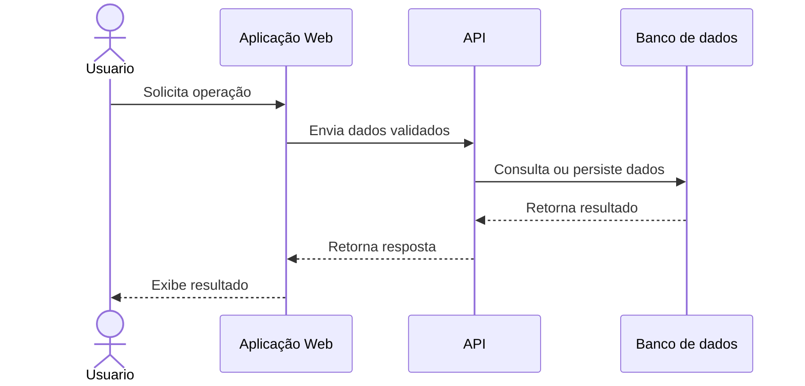
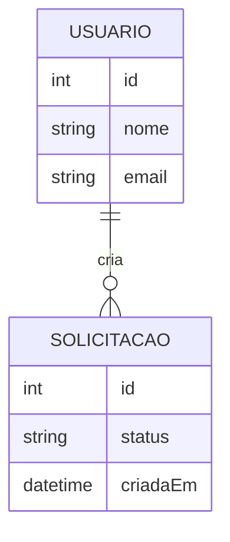

# Modelagem do sistema

> **Artefato central da Sprint 3.** Os modelos devem explicar a estrutura e o comportamento da solução e corresponder aos requisitos e ao código.

## 1. Modelos selecionados

| Modelo | Tipo | Pergunta que ele ajuda a responder | Requisitos relacionados |
|---|---|---|---|
| `[Nome]` | Comportamental | `[Como um fluxo acontece?]` | `RF-XX` |
| `[Nome]` | Estrutural | `[Como dados ou elementos se relacionam?]` | `RF-XX` |

## 2. Exemplo de modelo comportamental em Mermaid

> Substitua pelo modelo real. O Mermaid é renderizado pelo GitHub e permanece versionado junto ao projeto.

**Descrição e decisões representadas:** `[PREENCHER]`

## 3. Exemplo de modelo estrutural em Mermaid

**Descrição e decisões representadas:** `[PREENCHER]`

## 4. Relação entre requisitos e modelos

| Requisito | Elemento do modelo | Como está representado | Alteração provocada no backlog/código |
|---|---|---|---|
| `RF-01` | `[PREENCHER]` | `[PREENCHER]` | `[Issue/commit]` |

## 5. Correspondência entre modelo e código

| Elemento modelado | Arquivo/diretório correspondente | Observação |
|---|---|---|
| `[Entidade/componente/fluxo]` | `[link relativo]` | `[PREENCHER]` |

## 6. Refinamentos identificados

- `[Requisito dividido, regra descoberta, entidade adicionada etc.]`

## 7. Histórico de atualização

| Sprint | Modelo alterado | Motivo | Evidência |
|---|---|---|---|
| Sprint 3 | `[PREENCHER]` | `[PREENCHER]` | `[link]` |
